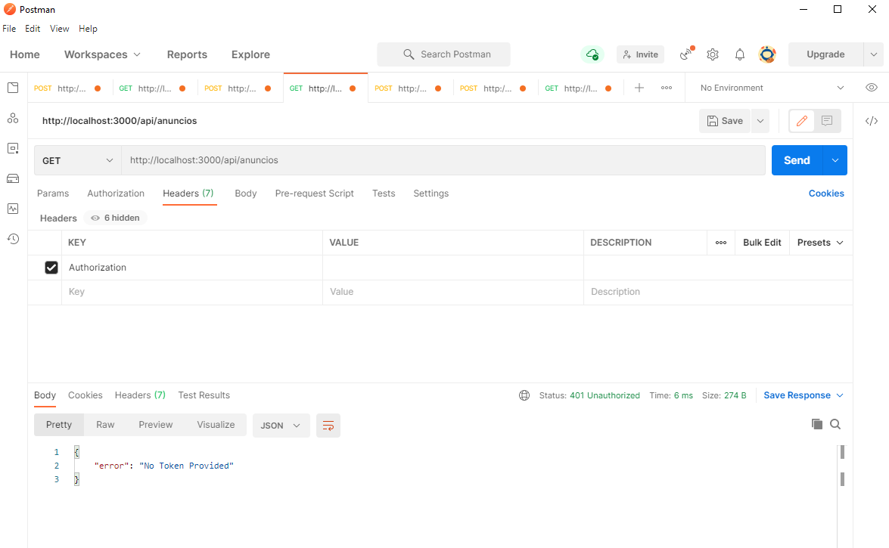

# Documentación Práctica Backend Avanzado

## Introducción 

Bienvenido de nuevo a la API Nodepop, esta nueva versión incluye mejoras de la primera versión del api `(https://github.com/amoltovil/Nodepop.git)` como son la autenticación del API con JWT (Json web token), internacionalización del website con la libreria i18n, subida de imagen al crear los anuncios con la libreria multer, y la creación de un microservicio con la libreria cote
que nos realizará un thumbnail de la imagen si el anuncio dado de alta contiene el campo foto.

Además, se ha realizado también la implementación de despliege de la aplicación en modo Cluster. También se ha implementa la realización de login y logout en el website.

Con la libreria jest y supertest se han realizado algunos test de integración sobre el API.
## Instalación del API 

## Deploy

Desde la consola y/o terminal, nos situaremos dentro de la carpeta nodepop e instalaremos las dependencias de nuestro proyecto con el siguiente comando:

```sh
npm install  
```

Crea el archivo .env copiando .env.example a .env y revisa la configuración del archivo.

```sh
cp .env.example .env
```
## Start Daemon MongoDB 

Necesitaremos descargar MongoDB en local [URL Available Downloads Mongodb] (https://www.mongodb.com/try/download/community), según nuestra plataforma (Windows, Ubunto, macOS, Amazon Linux, etc..)

### Comando para arrancar MongoDB (mac/linux)

~~~
./bin/mongod --dbpath ./data/db
~~~

En Windows, el mongod se instala como demonio o servicio (MongoDB Server), comprobaremos que se esté ejecutando.

## Cliente de MongoDB (mac/linux/windows)

En la carpeta dónde se haya instalado MongoDB, tendremos que buscar el cliente de mongoDB (fichero mongo.exe) para ejecutarlo en nuestro proyecto en una nueva terminal.


## Database initialization

Si queremos iniciar nuestra BD de MongoDB con una colección de usuarios y anuncios, podemos ejecutar:

```sh
npm run initDB
```

Este comando ejecuta el script (con confirmación previa por parte del usuario) que elimina todos los documentos de nuestra colección de anuncios, e inserta los documentos dado un fichero JSON (anuncios.json) contenido en el proyecto en la carpeta nodepop. Además, borra los documentos de la colección usuarios y crea dos usuarios hardcodeados.

## Start Server

En este punto, ya podremos ejecutar nuestra aplicación para probar que podemos acceder a la URL http://localhost:3000 de nuestro website con el comando:

```sh
node ./bin/www
```
O bien:

```sh
npm run start ó npm start
```
## Start Server and workers (cluster mode)

De esta manera, arranca el servidor y tantos workers como cores disponga la máquina dónde se ejecuta.

```sh
node ./bin/cluster
```
o bien:

```sh
npm run cluster
```
## Start Thumbnail Service

Para arrancar el microservicio de creación de thumbnails, en una nueva consola y/o terminal ejecutaremos el siguiente comando:

```sh
npm run thumbnailService
```

Las imágenes generadas por el microservicio se almacenan en la ruta: \public\images\anuncios\thumbnails
## Herramienta PM2

PM2 es un administrador de procesos demonio que nos ayudará a administrar y mantener las solicitudes de nuestros procesos online 24/7.

```sh
npx pm2 start
```

Con este comando podemos arrancar tanto nuestro servidor como el microservicio **thumbnailService**, esto esta configurado en el fichero ecosystem.config.js que se crea al ejecutar el comando **npx pm2 ecosystem**.

## Start Integration Tests

Ejecutara los tests implementados a nuestra API sobre los endpoints GET /api/anuncios y GET /api/anuncios/:id sin JWT y con JWT.

```sh
npm test
```
## API JWT Authentication  

Estos métodos se han probado desde la aplicación Postman que nos podemos descargar de su website [Site PostMan](https://www.postman.com). 

### POST /api/authenticate 

- Con Usuario Válido:

Desde la aplicación Postman, con el método POST realizamos la llamada a la url http://localhost:3000/api/authenticate, en el body de la request con el modo x-www-form-urlencoded seleccionado, le pasamos los valores email y password de un usuario válido. Al pulsar el botón SEND nos devuelve un status 200 y un JWT (Json web token).  


- Con Usuario No Válido:

En este caso, rellenamos los valores de email y password con un usuario no registrado en nuestra colección de usuarios y realizamos la misma prueba anterior. Al pulsar el botón de SEND nos devuelve un status 401 Unauthorized y un Json con el error:

~~~
{
    "error": "Invalid credentials"
}
~~~


### GET /api/anuncios (con JWT correcto)

Con un token correcto no caducado el API nos mostrará los anuncios que hayamos solicitado en la petición con los filtros que hayamos querido establecer.

- Incluyendo el JWT en una cabecera con la clave o key Authorization:


- Incluyendo el token en query-string:

Si incluimos como filtro en nuestra petición ?token = JWT válido no caducado, el api nos devolverá un JSON con los anuncios que cumplan con los filtros establecidos en la query-string.


### GET /api/anuncios (sin Token)

Tanto desde Postman como desde query-string nos devuelve un Json con el error de no token provided.
~~~
{
    "error": "No Token Provided"
}
~~~

- Desde Postman:



- Desde query-string:


### GET /api/anuncios (con Token caducado)

Con un token caducado el API nos mostrará el siguiente error:

~~~
{
    "error": "jwt expired"
}
~~~

- Desde Postman:


- Incluyendo el token en query-string:


#### Imágenes del proyecto

Las imágenes utilizadas en el proyecto se han obtenido de las siguientes webs gratuitas:

- [Pexels.com] (https://www.pexels.com)

- [istockphoto.com] (https://www.istockphoto.com) 
